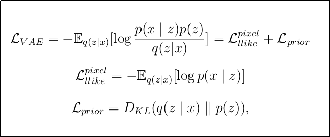
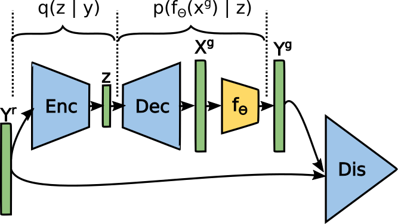
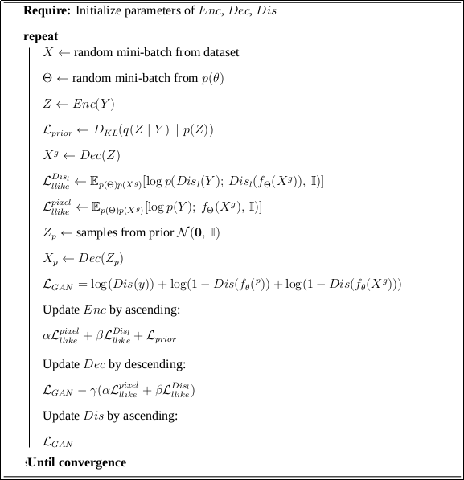
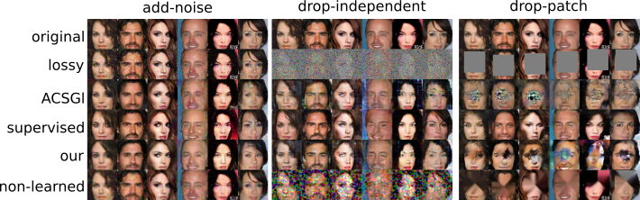
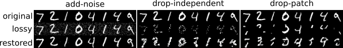
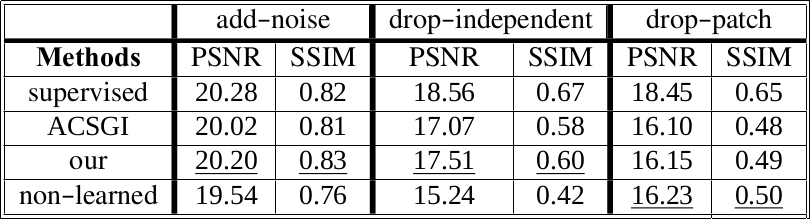

# Ambient VAE-GAN
In this project we present a new VAE training procedure inspired by [Ambient GAN]() reseach. For specific known group of forward models, our model has the ability to transform distorted images to clear ones without any supervision. 

## Dependencies

* numpy
* Tensorflow>=1.8
* scipy 

## Dataset

[CelebA dataset](http://mmlab.ie.cuhk.edu.hk/projects/CelebA.html) - Using aligned images and then resizing it to 64x64 pixels

## Overview

  In this method, we reformulate the VAE loss in order to train the network with distorted images. To strengthen the ouput image quality, similar to [Auto-encoding beyond bayse approach], we add GAN loss to the model.

*Equation 1. Combined loss function*

As we have the approximation of posterior distribution, we have the relationship between pairs of distorted and clear images. So the problem is solved, at the infrence time, our ambient-VAE can be interpreted as an unsupervised image enhancer.
 
The training procedure of network has been shown in Fig.1. likwise VAE-GAN, we have three sub-networks of Encoder, Decoder and Discriminator. we assume that the auto-encoder network outputs clear image and we ourselves distort it with known forward model. Then, we input the discriminator with the distorted images. 

*Fig.1 Network training procedure*
 
Algorithm of trainig has been presented below.

*Fig.2 Algorithm of training*

## Qualitative Results

### CelebA
 We design three baselines of Supervised, ACSG ( combination of [CSGAN]() and [Ambient-GAN]()) and non-learned methods and compare our restored images with theirs visually. For three forward models of drop-independet, drop-patch and add-noise, the results have been presented in Fig.2 
	

*Fig.3 CelebA results*

### Mnist

Our resutls for Mnist dataset has been displayed in Fig.3

*Fig.4 mnist-results*

## Quantitative Results

For two criterion of PSNR and SSIM, we have compared our quantitative results with mentioned baselines, in Table.1.

*Table.1 Quantitative comparison*

Moreover, we have compared our MSE/time of our method to unsupervised baselines in Fig.4 . Since ACSG is an iterative method, we have plotted the relationship between MSE and time (in second) for this method. As it is shown in the figuer, our method has both the least performance time and MSE. Furthermore, the ACSG approach consumes 200 times as much as ours in order to have the same MSE.

*Fig.5 Timing preformance comparison*

## Usage:

**For training the model**

* python main.py

**For testing**

* python main.py --op 1

