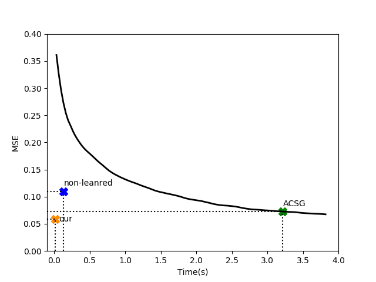

# Ambient VAE: an unsupervised method for image restoration
In this project, we present a new VAE training procedure inspired by [Ambient GAN](https://openreview.net/forum?id=Hy7fDog0b) article. For a specific known group of forward models, our model is able to transform lossy images to clear ones without any supervision. 

## Dependencies

* numpy
* Tensorflow>=1.8
* scipy 

## Dataset

[CelebA dataset](http://mmlab.ie.cuhk.edu.hk/projects/CelebA.html) - Using aligned images and then resizing it to 64x64 pixels  
[mnist dataset](http://yann.lecun.com/exdb/mnist/)

## Overview

 We reformulate the VAE loss in order to enable the network to be trained with lossy images. To increase the quality of output images, similar to [Autoencoding beyond pixels using a learned similarity metrich](https://arxiv.org/abs/1512.09300) method, we add GAN loss to our objective.

<!--  -->

*Equation 1. Our objective*

As we compute the approximation of posterior distribution, we have the relationship between pairs of lossy and clear images. As a result, at the inference time, our ambient-VAE can be interpreted as an unsupervised image enhancer.
 
The training procedure of the network has been shown in Fig.1. Likewise VAE-GAN, we have three sub-networks of Encoder, Decoder, and Discriminator. we assume that the auto-encoder network outputs a clear image and we distort it with a known forward model. Subsequently, we input the discriminator with the lossy images. The discriminator measures the distance between the original lossy images' distribution and generated lossy images.

*Fig.1 Network training procedure*
 
Algorithm of our training is presented below.

*Fig.2 Algorithm of our training*

## Qualitative Results

### CelebA
 We design three baselines of Supervised, ACSG ( combination of [CSGAN](https://arxiv.org/abs/1703.03208) and [Ambient-GAN](https://openreview.net/forum?id=Hy7fDog0b)) and non-learned techniques. For three forward models of drop-independent, drop-patch, and add-noise, the output image of the baselines is shown in Fig.3. 
    

*Fig.3 CelebA results*

### Mnist

Our results for Mnist dataset is demonstrated in Fig.3

*Fig.4 mnist-results*

## Quantitative Results

For two criterion of PSNR and SSIM, we have compared our quantitative results with mentioned baselines, in Table.1.

!

*Table.1 Quantitative comparison*

Moreover, we have compared  MSE/time of our method with unsupervised baselines in Fig.4. Since ACSG is an iterative method, we have plotted the relationship between MSE and time (in seconds) for this approach. Our method has both the least performance time and MSE. Furthermore, the ACSG approach consumes 200 times as much as ours in order to achieve the same MSE.

*Fig.5 Timing performance comparison*

## Usage:

**For training the model**

* python main.py

**For testing**

* python main.py --op 1

